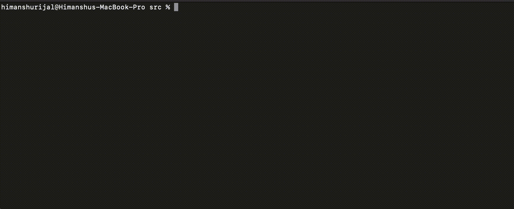

# Transaction Manager

Transaction Manager is an in-memory simulation of a database transaction manager.

## How to run the application 

To run the application:
1. Fork the repository, clone it, and open the project root folder in the Command Line Interface (CLI)
2. Once at the the root folder, to cd into the src folder use the command: `cd src`
3. Once at the src folder, first open the Makefile and edit the `TXMGR=..` line to `TXMGR= complete_path/to/project_root_folder`. Save and exit
4. Then, to compile the source code use the command: `make`
5. Then, to run/test the application use the command: `./zgt_test ../test-files/<any_test_file>.txt`

## More about the application

The transaction manager implements a strict Two-Phase locking protocol to manage transactions (concurrency control). The following operations are currently supported within transactions:

1. **Begin**: This operation will begin/start the transaction.
2. **Read**: This operation will print the value (a number) of the current object held by the transaction. 
3. **Write**: This operation will increase and print the value (a number) of the current object held by the transaction. 
4. **Commit**: This operation will free all objects held by the commiting transaction, and release all transactions waiting on the commiting transaction.
5. **Abort**: This operation is similar to the Commit operation.

## Demo

